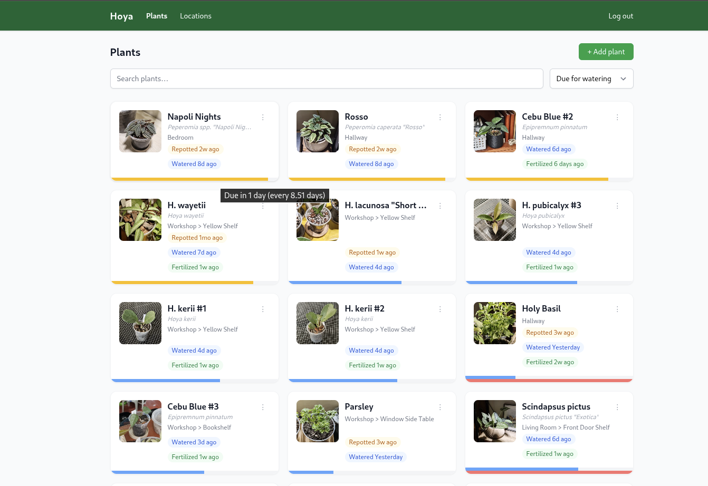
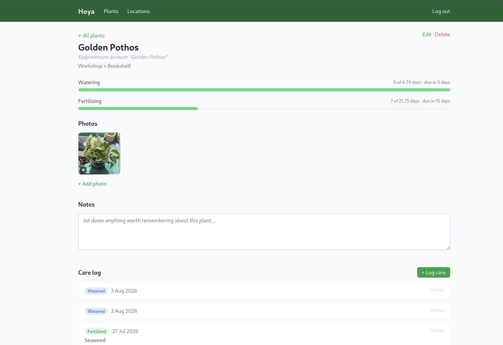

# Hoya

A self-hosted houseplant tracker. Keep tabs on where each plant lives, when it
was last watered or fertilized, and how it's doing over time with photos and
notes.

It learns how often you water each plant so it can tell you which plants need your attention that day.





## Features

- Track plants with species, propagation date, and nested locations
  (e.g. `Workshop > Yellow Shelf`)
- Watering and fertilizing intervals with due/overdue progress bars
- Care log for watering, fertilizing, and repotting events
- Photo uploads with automatic thumbnail generation and EXIF-based capture
  dates
- Free-text notes per plant

## Stack

- **API**: Django + Django REST Framework, PostgreSQL, Celery/Redis for
  background jobs
- **Web**: Vue 3 + Vite + Tailwind CSS

## Local development

The project runs entirely through Docker Compose — no local Python or Node
install is required.

```bash
cp .env.example .env
docker compose up --build
```

This starts Postgres, Redis, the Django API (with migrations run
automatically beforehand), a Celery worker and beat scheduler, and the Vite
dev server.

- Web UI: http://localhost:5173
- API: http://localhost:8000/api/
- Admin: http://localhost:8000/admin/

Create an admin user with:

```bash
docker compose exec api python manage.py createsuperuser
```

`docker-compose.override.yml` bind-mounts `api/` and `web/` into their
containers, so local edits are picked up without rebuilding the images.

## Deployment

The same `docker-compose.yml` used for local development is meant to run in
production — `docker-compose.override.yml` is what changes local behavior
(source bind-mounts, live reload), so a production host should run:

```bash
docker compose -f docker-compose.yml up -d --build
```

without the override file.

### Services

| Service   | Purpose                                                           |
|-----------|--------------------------------------------------------------------|
| `db`      | PostgreSQL, data persisted in the `postgres_data` volume           |
| `redis`   | Celery broker/result backend                                       |
| `migrate` | Runs `migrate` once, before `api`/`worker`/`beat` start             |
| `api`     | Django app served via `runserver`, collects static files on boot   |
| `worker`  | Celery worker for background tasks                                 |
| `beat`    | Celery beat scheduler (database-backed schedule)                   |
| `web`     | Vue app served by the Vite dev server                               |

Uploaded photos and thumbnails are stored in the `media_data` volume (mounted
at `MEDIA_ROOT`, default `/media`). Set `MEDIA_PATH` in `.env` to bind-mount a
host directory instead if you want media on disk outside of Docker's volume
storage.

### Configuration

All configuration is via environment variables — copy `.env.example` to `.env`
and adjust. Notable production settings:

- `SECRET_KEY` — set to a unique, secret value (never use the dev default)
- `DEBUG` — set to `false`
- `CSRF_TRUSTED_ORIGINS` — the public URL(s) the web app is served from
- `VITE_API_URL` — public URL the frontend should call for the API
- `WATERING_INTERVAL_WINDOW` — days used by the worker when recalculating
  watering intervals

### Reverse proxy / TLS

The `api` and `web` containers listen on plain HTTP (`API_PORT` and
`WEB_PORT`, default `8000`/`5173`). Put a reverse proxy (e.g. nginx, Caddy,
Traefik) in front of them to terminate TLS and route requests to each
service.

### Updating

```bash
git pull
docker compose -f docker-compose.yml up -d --build
```

The `migrate` service re-runs on every `up`, applying any new migrations
before `api`, `worker`, and `beat` start.

## License

This work is licensed under the [Creative Commons Attribution 4.0
International License (CC BY 4.0)](https://creativecommons.org/licenses/by/4.0/).
See [LICENSE.md](LICENSE.md) for details.
